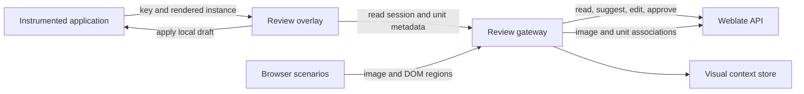

# In-context localization review

## Status

Proposed architecture and implementation guide for an in-context review workflow
backed by Weblate.

## Goal

Let linguistic reviewers inspect, correct, suggest, and approve translations in
the application UI where each string is used. The workflow must retain Weblate
as the authority for translation content, permissions, checks, history, and
review state.

The system should support two complementary review surfaces:

- A live review mode that overlays translation controls on an instrumented app.
- Reproducible screenshots with identifiable regions for states that cannot be
  kept available interactively.

## Design principles

- Show the real target translation while reviewing it. Do not make reviewers
  work in a UI filled with keys, hashes, or URLs.
- Use application localization keys as canonical identities. Weblate unit IDs
  and hashes are bindings that can be regenerated.
- Preview drafts locally before writing them to Weblate.
- Default linguistic reviewers to suggestions; reserve direct edits and
  approval for users with the corresponding Weblate permissions.
- Capture UI state as structured data, not only as an image.
- Keep Weblate credentials and privileged API access out of the reviewed app.
- Make stale bindings and stale screenshots visible rather than silently
  applying edits to the wrong source revision.

## Identity model

Each localizable resource has a canonical application identity:

```text
<project>/<component>/<namespace>/<key>
```

For example:

```text
sample-i18n/messages/application/navigation.home
```

A binding registry maps that identity to Weblate:

```json
{
  "project": "sample-i18n",
  "component": "messages",
  "namespace": "application",
  "key": "navigation.home",
  "sourceUnitId": 101,
  "targetUnits": {"de": 202},
  "sourceIdHash": 123456789,
  "sourceContentHash": 987654321,
  "sourceLastUpdated": "2026-08-24T10:00:00Z"
}
```

Identity roles:

- Canonical identity: project, component, namespace, and localization key.
- Weblate API locator: numeric unit ID.
- Weblate binding check: `id_hash`.
- Source drift check: `content_hash` and `last_updated`.
- Human navigation: `web_url` permalink.
- Rendered occurrence: an ephemeral instance ID for repeated uses of one key.

Weblate permalinks use a hexadecimal checksum derived from `id_hash`. The hash
is format-dependent: it can derive from context alone or from source and
context. Neither the permalink checksum nor a numeric database ID is therefore
a portable application identity across all imports, source edits, restores, or
Weblate instances.

The registry should primarily resolve keys against source-unit context or other
format-specific key metadata. It should be rebuilt after source imports and
should report missing, duplicate, and changed bindings.

## Architecture



### Instrumented application

The application renders its normal target-language text and exposes identity
metadata without changing visible content:

```html
<button
  data-l10n-project="sample-i18n"
  data-l10n-component="messages"
  data-l10n-key="navigation.home"
  data-l10n-instance="runtime-42"
>
  Startseite
</button>
```

Framework adapters should provide an explicit registration API when localization
helpers return plain strings or render multiple nodes:

```javascript
review.register(element, {
  project: "sample-i18n",
  component: "messages",
  namespace: "application",
  key: "navigation.home",
  values: {},
});
```

The registration event can include interpolation values and plural category,
but values containing personal or secret data must be redacted before leaving
the browser.

### Review overlay

Review mode is loaded only for an authenticated, short-lived review session. It:

- Discovers registered visible occurrences, including SPA updates.
- Draws non-layout-changing outlines and status markers in a separate overlay
  layer.
- Identifies status with icons or labels as well as color.
- Opens a side panel when an occurrence is selected.
- Shows source, target, explanation, location, checks, provenance, comments,
  suggestions, history, and other visible occurrences.
- Applies draft translations locally for immediate layout validation.
- Supports keyboard navigation between visible occurrences.
- Restores the server translation when a draft is discarded.
- Captures a full-page PNG without review controls and draws a visible outline
  around the selected occurrence.

A draft preview must preserve the application's normal escaping and rich-text
rendering path. The overlay must not inject arbitrary translated HTML.

### Review gateway

A small backend-for-frontend mediates all Weblate access. It:

- Creates short-lived review sessions after authenticating the reviewer.
- Resolves canonical keys using the binding registry.
- Returns only metadata authorized for the current project and language.
- Creates translation-specific comments on selected target units.
- Creates suggestions by default.
- Performs direct unit updates and approvals only with explicit permission.
- Checks `content_hash` and `last_updated` before writes to prevent stale edits.
- Records route, build revision, locale, occurrence, and review-session audit
  data.
- Rate-limits requests and validates application origins.
- Accepts PNG screenshots up to 8 MB, uploads them under the source language,
  and associates the corresponding source unit.

Weblate API tokens remain server-side. Browser sessions should use secure,
HTTP-only, same-site cookies or short-lived audience-bound credentials.
Screenshot uploads require a Weblate API token with screenshot add and edit
permissions.

### Weblate integration

The initial integration can use existing APIs:

- Read unit metadata with `GET /api/units/{id}/`.
- Update a translation with `PATCH /api/units/{id}/` using both `target` and
  `state`.
- Add reviewer proposals with `POST /api/units/{id}/suggestions/`.
- Add context discussion with `POST /api/units/{id}/comments/`.
- Upload screenshots with `POST /api/screenshots/`.
- Associate screenshots with source units using
  `POST /api/screenshots/{id}/units/`.

The gateway should use Weblate's permission result as authoritative and must not
infer edit or approval rights solely from application roles.

## Pseudo-language fallback

Some applications cannot retain metadata through their rendering framework. A
dedicated review locale can then transport compact markers:

```properties
navigation.home=⟦rv:7K3M2⟧Home
button.save=⟦rv:91AXQ⟧Save
```

The token is an opaque build-local reference into a signed manifest. It is not a
Weblate unit ID, hash, API token, or URL. The review runtime recognizes the
marker, annotates the owning node, removes the marker, and inserts the real
target translation before review begins.

This fallback must be restricted to review environments. It is less reliable
for attributes, split text nodes, rich text, Shadow DOM, canvas content, browser
native dialogs, and assistive technology. Explicit framework instrumentation is
the preferred integration.

Expansion and bidirectional pseudolocalization remain separate diagnostic modes;
they should not be overloaded as identity transport.

## Automated visual evidence

A browser automation scenario records a deterministic application state:

1. Start an instrumented review build at a known revision.
2. Select locale, viewport, theme, feature flags, and fixture data.
3. Navigate and interact to reveal menus, dialogs, errors, empty states, and
   responsive variants.
4. Wait for application and font stability.
5. Collect visible registered occurrences and their DOM rectangles.
6. Mask configured personal, secret, and volatile regions.
7. Capture the viewport or full-page image.
8. Upload the image to Weblate and associate all source units.
9. Store region and scenario metadata in the visual context store.

A region record contains normalized coordinates so it remains meaningful when
the image is displayed at a different size:

```json
{
  "screenshotId": 55,
  "canonicalKey": "sample-i18n/messages/application/navigation.home",
  "instance": "runtime-42",
  "rect": {"x": 0.11, "y": 0.22, "width": 0.18, "height": 0.05},
  "visibleText": "Startseite",
  "route": "/settings",
  "viewport": {"width": 1440, "height": 900},
  "buildRevision": "git-sha"
}
```

Interactive review capture provides a smaller version of this workflow. The
reviewer can capture the current full page from the selected occurrence's side
panel. Review controls are omitted, and the selected translated string is
outlined directly in the PNG before the browser sends it to the gateway. The
gateway uploads the image under the source language and associates the matching
source unit without exposing Weblate credentials to the browser.

Weblate currently associates screenshots with units but does not store a region
or bounding box per association. The first implementation should use a companion
visual context store. A later Weblate extension can add a through model with
coordinates and capture metadata if the workflow proves generally useful.

## Human review workflow

1. A reviewer opens a signed review URL for a build, project, and locale.
2. The application displays real translations and marks reviewable occurrences.
3. The reviewer filters visible strings by untranslated, needs editing,
   automatically translated, failing checks, suggested, or unapproved state.
4. Selecting a string opens its context panel and highlights every visible
   occurrence of the same key.
5. Editing creates a local draft and updates all matching occurrences.
6. The reviewer tests responsive sizes and interactive states.
7. The reviewer submits a suggestion or, when permitted, saves the translation.
8. A reviewer with approval permission approves the accepted result.
9. The gateway refreshes Weblate state and records the reviewed build and route.

Screenshot review uses the same panel and commands. Selecting a marked region
identifies the unit; selecting a unit highlights all regions where it occurs.

## Complex content

- Duplicate source text: resolve by canonical key, never by displayed text.
- Repeated key: use one unit identity and multiple occurrence IDs.
- Plurals: annotate the selected plural category and edit the complete Weblate
  plural target array; offer scenarios for each category.
- Interpolation: preview using captured redacted values and validate placeholder
  preservation before submission.
- Rich text: bind the outer translation operation and preserve named child
  elements; never map arbitrary descendant text independently.
- Concatenated strings: flag as an instrumentation defect because reviewers
  cannot safely translate sentence fragments in isolation.
- Canvas and native UI: use explicit application hooks or screenshot regions.
- Responsive UI: capture and review configured breakpoint scenarios rather than
  resizing one screenshot.
- Dynamic content: distinguish localized product strings from user or server
  content before registration.

## Security and privacy

- Prefer a dedicated review or staging environment.
- Never ship Weblate service credentials in client bundles.
- Allowlist reviewed origins and routes.
- Use Content Security Policy entries scoped to the review gateway.
- Prevent the overlay from reading password, payment, token, and configured
  private-data fields.
- Disable arbitrary navigation and external URL capture in automated scenarios.
- Sanitize translation previews through the application's existing rendering
  rules.
- Store the minimum screenshot data and apply project retention policies.
- Audit suggestions, edits, approvals, captures, and binding changes.

## Failure handling

The UI must expose these conditions explicitly:

- Key has no Weblate binding.
- Key resolves to multiple source units.
- Source content changed since the review session began.
- Target changed after a local draft was created.
- Captured screenshot belongs to an older build.
- A registered node disappeared during an SPA update.
- Reviewer lacks permission for the requested action.

No stale or ambiguous edit should be submitted automatically.

## Delivery plan

### Phase 1: read-only proof of concept

- Define the binding registry format and resolver.
- Instrument one sample application route with stable localization keys.
- Add a manually enabled overlay that discovers and highlights occurrences.
- Resolve and display Weblate unit metadata through a local gateway.
- Open the existing Weblate permalink as an escape hatch.

### Phase 2: assisted review

- Add local draft replacement.
- Add comments and suggestions.
- Add conflict detection using content and update metadata.
- Add status filters and keyboard navigation.

### Phase 3: governed editing

- Add direct edit and approval based on Weblate permissions.
- Add plural, interpolation, and rich-text adapters.
- Add audit events and review completion reporting.

### Phase 4: automated visual evidence

- Add browser scenario capture.
- Upload screenshots and associate source units.
- Add the visual context store and annotated screenshot viewer.
- Report route, state, locale, and breakpoint coverage.

### Phase 5: Weblate product integration

After validating the companion implementation, decide whether to upstream:

- A stable key-resolution API.
- Screenshot region models and APIs.
- Review-session credentials.
- Embedded context panels or links to the live review surface.

## Initial success criteria

The proof of concept is successful when a reviewer can:

- Open the sample application in German review mode.
- Select the rendered `navigation.home` label without seeing an identity marker.
- See the correct source and German Weblate unit metadata.
- Open its Weblate permalink.
- Preview a draft translation locally without changing Weblate.
- Submit that draft as a Weblate suggestion through the gateway.
- Detect a stale source or target before submission.

It must also demonstrate that no Weblate credential is present in browser source,
storage, or network requests to the reviewed application.

## Prior art and deliberate differences

Crowdin and Phrase commonly expose decorated pseudo-language keys and use a
browser script to replace them with editable labels. XTM Rigi emphasizes
ID-based matching, recorded application states, and dynamic previews. These
systems validate the value of immediate visual feedback, stable identity, and
automated capture.

This design deliberately uses explicit instrumentation as the primary path. It
retains real translated text, avoids parsing visible content, separates durable
application identity from TMS database identity, and treats screenshots as
reproducible evidence rather than the sole translation surface.
